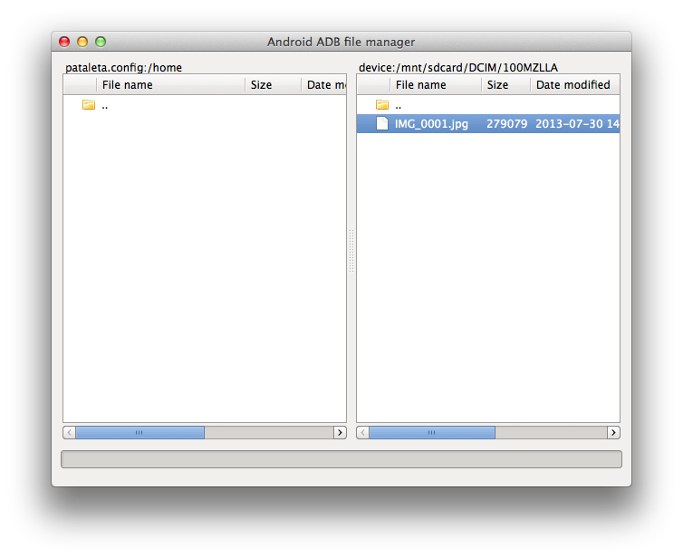

# Firefox OS guide

This is a perpetual work-in-progress; new content is added as I learn about it. If you want to contribute, do it! Make changes and send a pull request.

## The Web API

Embracing the Open Web Apps spirit (and standard-to-be)!

### Web Activities

* [Description](https://developer.mozilla.org/en-US/docs/WebAPI/Web_Activities)
* [Specification](https://wiki.mozilla.org/WebAPI/WebActivities)

Firefox OS exposes the (not yet standard) MozActivity API.

* [Sharing images](chapters/webapi-activities-sharing-images.md)

## Translations, internationalisation and localisation

gettext can be used. It's pretty much like the standard and is very mature and solid but has some shortcomings. i10n and l20n have been created to overcome these shortcomings.

* [gettext](http://en.wikipedia.org/wiki/Gettext). See the code for [High Fidelity](https://github.com/mozilla/high-fidelity) podcasts app for an example of using gettext for translations. Includes a [Makefile](https://github.com/mozilla/high-fidelity/blob/master/Makefile) for processing the translations and converting them into .json files ready for being used in the JS code.
* l10n "localisation" - [webL10n](https://github.com/fabi1cazenave/webL10n)
* l20n aka "l10n version 2", aggregating l10n (localisation) and i18n (internationalisation) - [L20n](https://wiki.mozilla.org/L20n) and [HTML with L20n](https://wiki.mozilla.org/L20n/HTML)

[Localizing Firefox OS Apps](https://hacks.mozilla.org/2013/08/localizing-firefox-os-apps/) is an article describing how Gaia apps use localisation.

## Accessibility

Support for accessibility is being worked on for Firefox OS 1.2. Marco Zehe has [a video](http://www.marcozehe.de/2013/07/19/small-demo-video-about-firefox-os-accessibility/) where he shows the current state of accessibility in Firefox OS devices--he demonstrates how the device can talk to you.

## Marketplace and selling

* [Badges](https://assets.mozillalabs.com/Projects/Firefox%20Marketplace/Badges/) for linking to your app in the Marketplace

## Resources and tools

(Just putting a list here for now. May expand into its own page if it gets too long)

### Mozilla Bricks & Mortar

[Brick](http://mozilla.github.io/brick/) is a set of UI Web Components for Mobile Web Apps.

Some Mortar templates that can be used as starting point:

* [App stub](https://github.com/mozilla/mortar-app-stub) - ultra minimal app template with a manifest and code for installing it.
* [Game stub](https://github.com/mozilla/mortar-game-stub) - game app stub

[Full list](https://github.com/mozilla/mortar) of Mortar repositories.

### Development tools

* [Yeoman generator for Firefox OS](https://github.com/pdi-innovation/generator-firefoxos) - if you find the idea of typing ```yo firefoxos``` quite funny, you'll love this one. Provides a set of command line tools for common tasks such as pushing apps to the device or reading their logs. Here's a [webcast](http://www.youtube.com/watch?v=VOQVuAfCDHc).

### Testing and automation

* [General testing](https://developer.mozilla.org/en-US/docs/Mozilla/Firefox_OS/Platform/Testing)
* [Marionette](https://developer.mozilla.org/en-US/docs/Marionette) automates things. High Fidelity uses it to [test the app](https://github.com/mozilla/high-fidelity/blob/master/test/marionette/test_app.py) using Python.

### File management tools

#### aafm



[aafm](https://github.com/sole/aafm) is a Python + GTK tool based on adb (the Android Debug Bridge that Firefox OS uses too). It allows for browsing phones' filesystems, and copying and reading files between the computer and the device.

## Key combinations

### Taking a screenshot

Press and hold the power and home buttons simultaneously.

## "Hacking"

"Advanced topics", for power users and tinkerers.

* [Running Gaia on your computer](chapters/hacking-running-gaia-on-your-computer.md)

### Accessing the simulator's JavaScript console

This would be roughly equivalent to connecting a physical device via USB and running ````adb logcat``` on it.

You have to launch the simulator from the command line. First make sure it is installed in Firefox, then locate your Firefox profile folder. There, locate the extensions folder, and inside it, locate the B2G executable.

We need to launch the B2G executable passing it the full path to the profile it uses. This profile is inside the simulator extension folder. Once you know all these data, you can finally launch the simulator from a terminal and get all the logging information in it.

An example of how to launch, using Mac OS:

````bash
/Users/(YOUR_USER_NAME)/Library/Application Support/Firefox/Profiles/(YOUR_PROFILE_FOLDER)/extensions/r2d2b2g@mozilla.org/resources/r2d2b2g/data/mac64/B2G.app/Contents/MacOS/b2g --jsconsole --profile /Users/(YOUR_USER_NAME)/Library/Application Support/Firefox/Profiles/(YOUR_PROFILE_FOLDER)/extensions/r2d2b2g@mozilla.org/profile
````

## Updating the software in physical phones

### Flashing new ROMs

* [Geeksphones](http://downloads.geeksphone.com/)


## Miscellanea: questions without answers (yet)

Either I don't know the answer or haven't had time to write it. Feel free to do it yourself: pull requests are _very_ welcome!

* How to brand Gaia. Make your phone truly yours. Change initial animation, look and feel, ringtones, etc.
* How to flash a custom Gaia build onto a phone.
* Is there an emulator, à la Android QEMU-based emulator?
